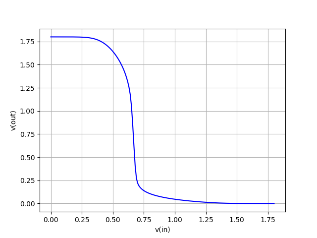

# ngspice-python

Code example to run Ngspice Raw File using Python Script


1. Import NgSpicedata module present in repo
```sh
from ngspicedata import *
```

2. Import Matplotlib module for plotting purpose
```sh
from pylab import *
import matplotlib.pyplot as pl
```

3. Load the simrun file using
```sh
data=NgspiceData("simrun.raw")
```

4. Print the simulation signal
```sh
sig_names = data.lssig('print') 
```

5. Store values in x an y
>In example code for inverter two signals "in" and "out" voltage is there.
```sh
x = data.evalsig('in')
y= data.evalsig('out')
```

6. Plot the Inverter Graph
```sh
fig = figure(1)
fig.clf()
plot(x,y,'b-')
plt.xlabel('v(in)')
plt.ylabel('v(out)')
grid(True)
pl.show()
```

   
